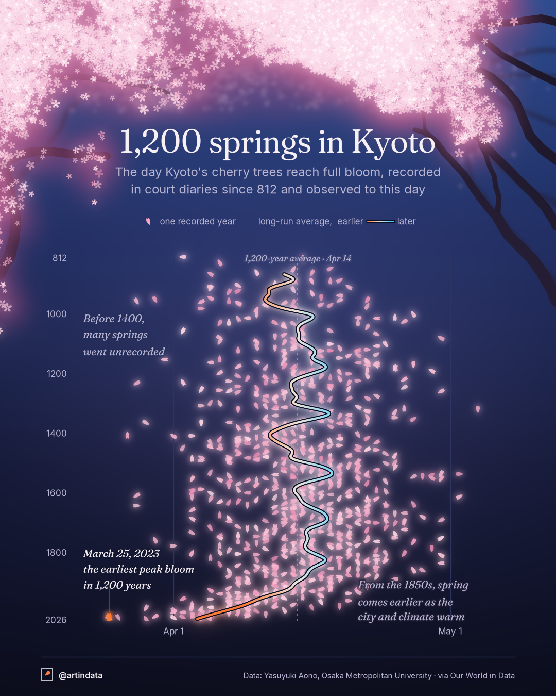

# artindata

Data visualizations made as art, and kept honest to the data.
New pieces are posted on Instagram and X as [@artindata](https://x.com/artindata).
This repo holds the code for every piece, as an educational reference.



## Posts
| # | Piece | Data |
|---|---|---|
| 001 | [1,200 springs in Kyoto](posts/001_kyoto-blossoms/): peak cherry blossom dates, 812–2026 | Y. Aono via Our World in Data |

## How it's organised
- `dataviz_style/` is the shared style: bundled fonts (Fraunces and Inter, SIL OFL),
  named themes, the layout grid, footer, signature mark and raster effects
  (blur, glow, light).
- `posts/NNN_slug/` holds one folder per post: the script, data, a README
  (source, license, what it shows, how it's built) and the output images.
- `brand/` holds the profile picture, mark masters and X header, all generated by script.

## Run it
```
python -m venv .venv
.venv/Scripts/pip install -r requirements.txt   # Windows; use .venv/bin/pip elsewhere
.venv/Scripts/python posts/001_kyoto-blossoms/kyoto_blossoms.py
```

## License
Code is under the [MIT License](LICENSE). Images are under
[CC BY 4.0](LICENSE-images.md). Fonts and data keep their own licenses.
