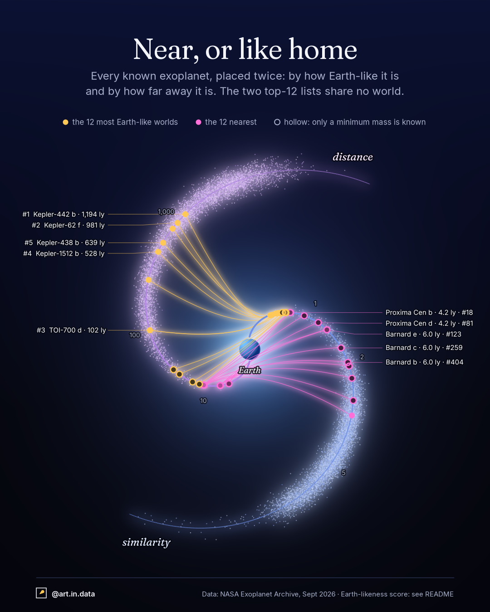

# 002 · Near, or like home



## What it shows
Every confirmed exoplanet that can be scored (5,700 of them), placed twice. Two
spiral arms leave Earth at the centre. Along the **similarity** arm (blue) a
planet sits by how far it is from Earth-like, and along the **distance** arm
(violet) by how far away it is in light-years. Both rulers are logarithmic.
Each speck of dust is a planet.

The 12 most Earth-like worlds are gold and the 12 nearest are rose. Each one
appears on both arms, joined by a thread of light. **The two lists share no
world.** The nearest planet on the Earth-like list is Teegarden's Star c, at
12.5 ly, and the most Earth-like planet among the 12 nearest is Proxima Cen b,
only #18 of 5,700.

Hollow markers mean only a minimum mass (M sin i) is known, so the planet could
be bigger than scored.

## The Earth-likeness score
Inspired by the Earth Similarity Index (Schulze-Makuch et al. 2011), but built
from three terms, each a log ratio divided by a "one step away" factor:

| term | what it compares | one step is |
|---|---|---|
| size | radius to Earth's (or mass, converted with R ∝ M^0.279) | ×1.5 |
| climate | sunlight against the conservative habitable zone (Kopparapu et al. 2014). Zero inside the zone | ×2 beyond an edge |
| star | star temperature to the Sun's | ×1.5 |

They are combined as a weighted root-mean-square, with weights 1, 1 and 0.5
(the star counts half). **The weights are an editorial choice**, not a
measurement. The ESI recomputed from the same data matches its published
rankings. In a ±50% perturbation of the weights the top 8 stay put. From rank 9
down, the order reshuffles. The score is a ranking of resemblance, not a
statement that any planet is habitable.

Top 12 (rank · planet · distance): 1 Kepler-442 b · 1,194 ly, 2 Kepler-62 f · 981 ly,
3 TOI-700 d · 102 ly, 4 Kepler-1512 b · 528 ly, 5 Kepler-438 b · 639 ly,
6 Kepler-1649 c · 301 ly, 7 TOI-700 e · 102 ly, 8 Wolf 1069 b · 31 ly,
9 Kepler-1229 b · 866 ly, 10 GJ 3378 b · 25 ly, 11 Teegarden's Star c · 12.5 ly,
12 GJ 1002 b · 15.8 ly.

Nearest 12 (rank in the score in brackets): Proxima Cen b (#18), Proxima Cen d (#81),
Barnard e (#123), Barnard c (#259), Barnard b (#404), Barnard d (#600),
eps Eri b (#1,530), GJ 887 d (#46), GJ 887 c (#121), GJ 887 b (#451),
GJ 887 e (#1,061), Ross 128 b (#19).

## Data
- **Source:** NASA Exoplanet Archive, Planetary Systems Composite Parameters
  (`pscomppars`), queried September 2026. 6,372 planets.
  *This research has made use of the NASA Exoplanet Archive, which is operated
  by the California Institute of Technology, under contract with NASA under the
  Exoplanet Exploration Program.*
- **Dropped:** planets the archive flags as controversial. 5,700 of the rest
  can be scored.

## Caveats
- Some archive values are calculations, not measurements, such as the insolation.
- Planets with only a minimum mass may be larger than scored.
- The habitable zone is the simple, conservative one. It ignores atmospheres,
  eccentric orbits and tidal locking.
- Ranks 9 and below depend on the weights.
- Distances are the star system's distance from the Sun. Planets of one
  system share a distance.

## How it's built
- `fetch_data.py` downloads the table and writes `data/planets.csv`.
- `similarity.py` computes the score.
- `exoplanets.py` draws both exports with `dataviz_style` (`deep_space` theme).
  - Position along an arm is the value, and the radius grows linearly with it.
    The twist is 0.6 turns.
  - The dust spread across an arm is random and moves specks sideways only, so
    each planet still sits at its value along the arm.
  - Every glow is a blurred copy of real marks. The sphere of Earth and its
    light are decoration: Earth is the origin, not a data point.
  - Gold #FFC857 and rose #FF6FD8 pass a colour-blindness check (ΔE 23.5).

```
python fetch_data.py
python exoplanets.py   # -> output/exoplanets_instagram.png, output/exoplanets_x.png
```
